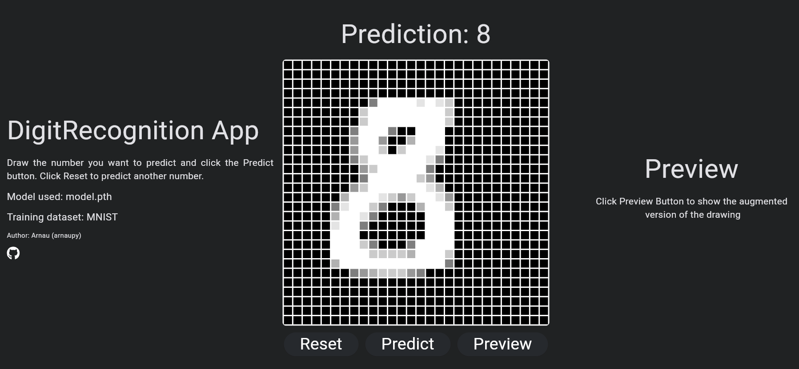

# Digit Recognition
⭐ App to recognize digits from 0 to 9. Using the new technology named flet, this project uses a simple computer vision model to train the famous [MNIST](https://pytorch.org/vision/main/generated/torchvision.datasets.MNIST.html) dataset to predict digits inpute by the user.

---
Author -> Arnau Pérez Pérez | [Github](https://github.com/arnaupy) | [LinkedIn](https://www.linkedin.com/in/arnau-perez-perez/) | 01arnauperez@gmail.com

---


## Installation Guide

* Place yourself into the desired directory and clone the repository.
```
git clone https://github.com/arnaupy/GiantsLegacy.git
```

* Create a virtual environment and active it. (In mac `python3`)
```
python -m venv .env 
source ./.env/bin/activate
```

* Install dependencies from [requirements.txt](./requirements.txt) file.
```
pip install -r requirements.txt
```

## Run the app
The project leverages the innovative technology [flet](https://flet.dev/), designed from the ground up with [Flutter](https://flutter.dev/monetization?gclid=Cj0KCQiA6vaqBhCbARIsACF9M6kNfJ9AUvv7r_4huKizP3kHGor1ZpwsY_dWoYmtjxe8q_sBCPsc260aAmj_EALw_wcB&gclsrc=aw.ds) for app development in Python (with support for additional languages in the future).

Flet provides the capability to run the developed app on the `local machine`, `web browser`, and even `mobile devices`, although the latter option did not function as expected in my experience.

Additionally, a simple Convolutional Neural Network (CNN) model has been implemented. Using MNIST training data, the model efficiently predicts numbers ranging from 0 to 9.

* To initiate the app setup, the first step is to train the model.
```
python app/train.py
```

* Afterward, you can test the app by executing the following command (include the `-w` flag to run the app in a web browser).
```
flet run app/main.py 
```

## Next Steps
* `Enhance package` installation by specifying installation of only essential components.
* `Boost app performance` by revising the import of PyTorch modules.
* `Supplement additional` documentation providing a detailed explanation of the model schema.
* `Revise the app layout` to enhance user-friendliness.
